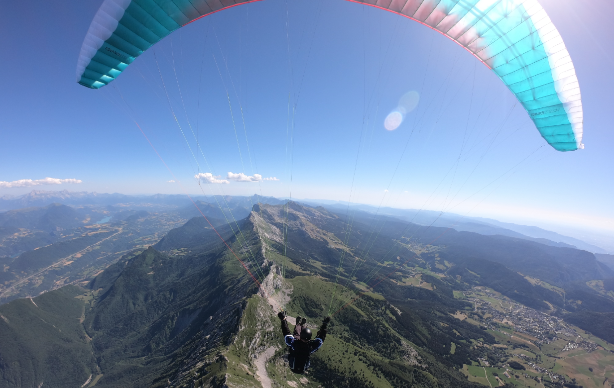

### 🖖 I'm Olivier Jacques

#### Work

I'm Distinguished Technologist, DevOps at [DXC Technology](https://www.dxc.technology/). I work on building, deploying and operating Software in the Cloud and on premises, the "DevOps" ([3 ways](https://itrevolution.com/the-three-ways-principles-underpinning-devops/) ways).

#### Not work

- :newspaper: I blog sometimes, and it's hosted here on GitHub: [ojacques.github.io](https://ojacques.github.io).
- :musical_keyboard: I play music (keyboard, drums) - check out my band: [Shiny Darkness](https://www.shinydarkness.com/albums/)
- I fly my paraglider in the Alps. Some [videos :clapper:](https://www.youtube.com/watch?v=EFSgRfM4bB8&list=PLXlngHSyS_5_1a0N_O7EIQbxPQbU_x9pm&index=1)

- 📫 How to reach me: [Twitter](https://twitter.com/ojacques2), [LinkedIn](https://www.linkedin.com/in/olivierjacques/).
- ⚡ Fun fact: my first computer was a Commodore Vic 20 with 3.5 kBytes of RAM
